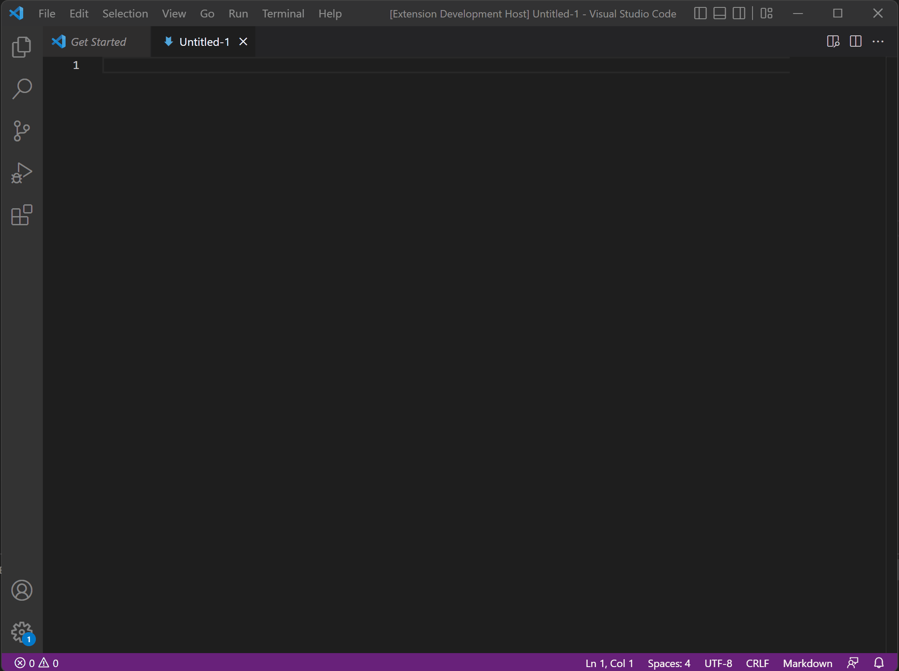

# A sample to reproduce a bug we found on the Web View when trying to Context-Copy an element
There seems to be an issue with WebView on VSCode where the context menu isn't working, but CTRL-C + CTRL-V does work.
So there's something off going on.
## Demo

## Running the example

- `npm install`
- `npm run watch` or `npm run compile`
- `F5` to start debugging

Run the `Open Web View with Elements to copy using context menu` to create the webview.
